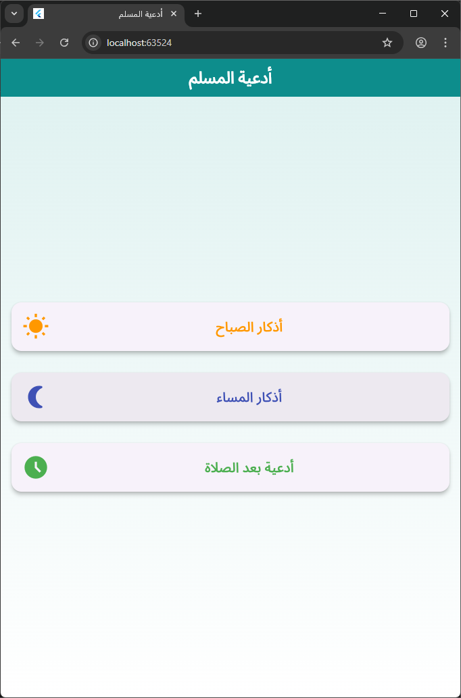
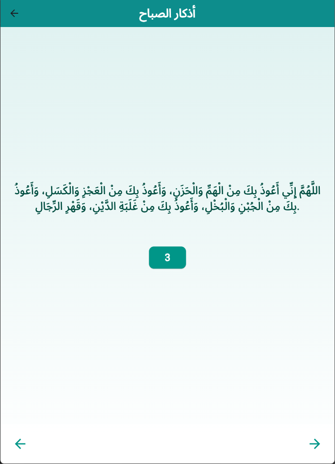
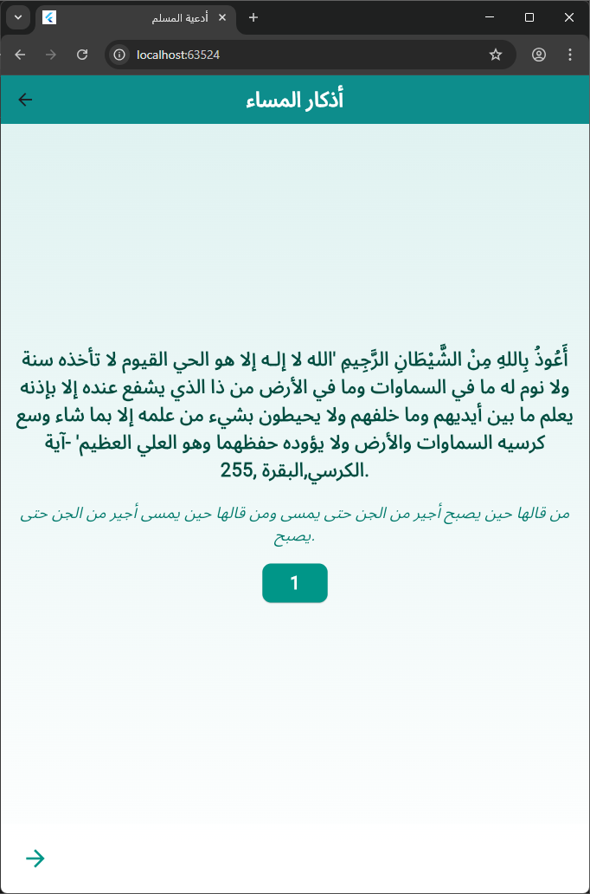
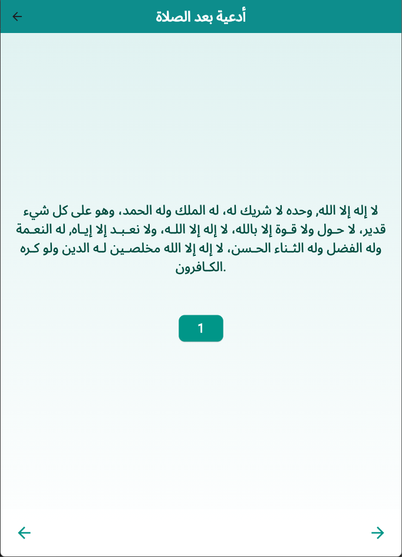

# 🌿 Azkar App (Flutter)

A simple and clean Flutter application for daily Azkar, designed with smooth navigation, clear counters, and an intuitive user experience.

---

## 📱 Overview

This application helps users read and follow daily Azkar in an organized and distraction-free way.

The app is divided into:

- A **Main Screen** that acts as a hub.
- **Three Azkar Screens** that share the same layout but display different content.

Each screen focuses on clarity, ease of navigation, and continuity while reading.

---

## 🏠 Main Screen

The main screen contains **three main buttons**.

Each button navigates the user to a different Azkar page:

1. Morning Azkar
2. Evening Azkar
3. Post-Prayer Azkar

Each page displays different Azkar data while keeping the same UI structure for consistency.

### 📸 Main Screen Screenshot



---

## 📄 Azkar Screens (Shared Layout)

All Azkar pages share the same design but load different content depending on the selected category.

This approach ensures:

- Consistent user experience
- Easier maintenance
- Better scalability

### Pages Included

- Morning Azkar
- Evening Azkar
- Post-Prayer Azkar

---

## 🔁 Navigation & Controls

Each Azkar screen contains the following controls:

### ⬅️➡️ Navigation Buttons

- **Next Button**: Moves to the next Zikr
- **Previous Button**: Returns to the previous Zikr

---

### 🔢 Counter Button

Each Zikr has a repetition counter.

- The counter decreases with each tap
- Once the counter reaches zero, the app automatically navigates to the next Zikr

This allows the user to focus on reading without manual counting.

---

### 🏠 Back to Home Button

At the top-left corner, a button allows the user to return to the **Main Screen** at any time.

---

## 📸 Azkar Screenshots

### Morning Azkar



### Evening Azkar



### Post-Prayer Azkar



---

## 🧱 Project Structure

```
lib/
├── main.dart
├── home.dart
├── sabah.dart
├── massa.dart
└── postprayer.dart
```

- **main.dart**: Application entry point
- **home.dart**: Main screen with navigation buttons
- **sabah.dart**: Morning Azkar screen
- **massa.dart**: Evening Azkar screen
- **postprayer.dart**: Post-prayer Azkar screen

---

## 🚀 Features

- Clean and minimal UI
- Smooth navigation between pages
- Shared layout with dynamic content
- Automatic Zikr counter handling
- Easy to extend with new Azkar categories

---

## 🔮 Future Improvements

- Dark mode support
- Save user progress
- Audio playback for Azkar
- Multi-language support
- Enhanced animations and transitions

---

## 🧑‍💻 Author

**Amr**  
Flutter Developer

---

## 📌 Summary

This project demonstrates clean Flutter navigation, reusable UI design, and practical state handling in a real-world mobile application.
