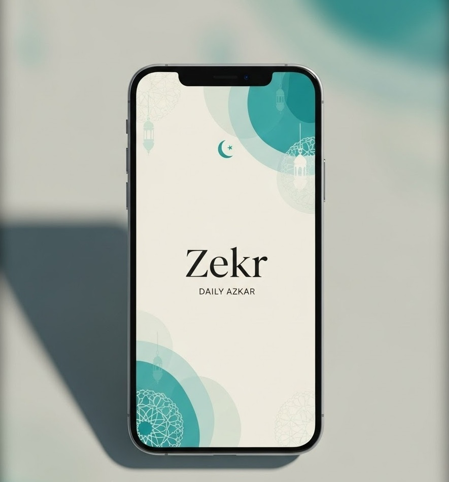
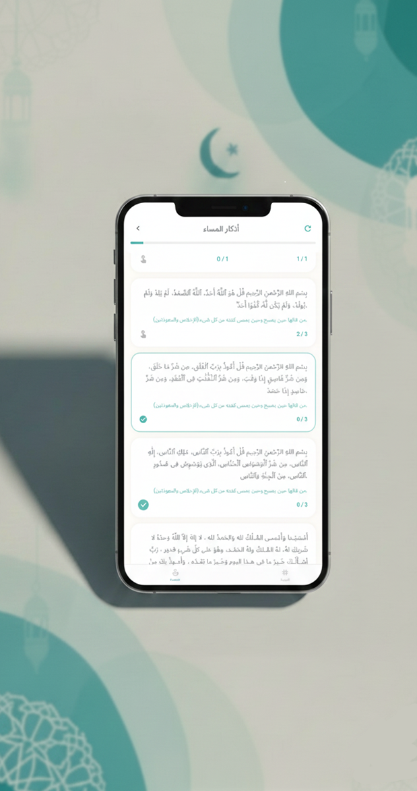
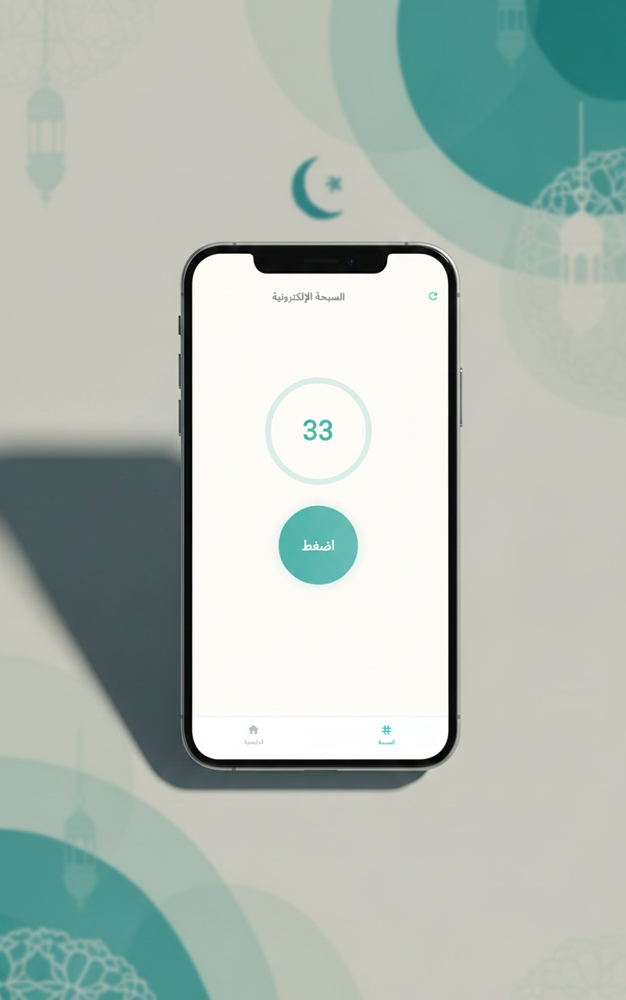

# 🌿 Zekr App

A clean, modern Islamic remembrance (Azkar) application built with
**Flutter**, focusing on simplicity, calm UI, and smooth user
experience.

---

## 📱 Overview

Zekr App is a modern Islamic remembrance application built using Flutter, designed to provide a calm, focused, and spiritually uplifting experience for users.

The application helps users maintain their daily remembrance through Morning Azkar, Evening Azkar, Post-Prayer Azkar, and a Digital Tasbih, with an emphasis on simplicity, clarity, and smooth interactio

---

## ✨ Features

- 📿 Morning Azkar
- 🌙 Evening Azkar
- 🕌 Post-Prayer Azkar
- 🔢 Digital Tasbih with persistent counter
- 💾 Progress saved automatically
- 🎨 Unified color theme
- ✨ Smooth animations

### 📸 splash screenshots



---

## 📸 Screenshots

The following screenshots demonstrate the main features and user flow of the application.

---

### 🏠 Home Screen


---

### 🌿 Core Features
<p align="center">
  
  
\</p>

---

### 📱 Full Application Overview


These screenshots highlight the app’s clean layout, unified color palette, smooth animations, and intuitive navigation.

---

## 📂 Project Structure

```
lib/
├── core/
│   └── app_colors.dart
│
├── models/
│   └── zekr_model.dart
│
├── services/
│   └── azkar_service.dart     # JSON loading + local storage
│
├── screens/
│   ├── splash_page.dart
│   ├── home.dart
│   ├── azkar_page.dart
│   └── tasbih_page.dart
│
├── widgets/
│   ├── bottom_nav.dart
│   ├── zekr_card.dart
│   ├── azkar_header.dart
│   └── home/
│       ├── greeting_section.dart
│       ├── prayer_card.dart
│       ├── main_azkar_row.dart
│       └── more_azkar_section.dart
│
├── layouts/
│   └── main_layout.dart
│
└── main.dart

```

---

## 📌 Summary

This project showcases clean Flutter navigation, reusable UI patterns,
and practical state handling in a real-world mobile application.
